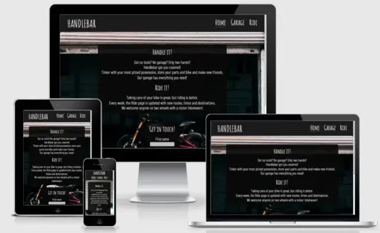

<h1 align="center" style="font-size: 250%;"><b>
Handlebar Garage Website
</b></h1>

[Check the live project here!](https://jfrdrkssn.github.io/first-project-ci/index.html)

This is the website for Handlebar Garage. It is designed to be responsive and

## **User Experience (UX)**  
---  

### **User stories**  
-list here-
**First Time Visitor Goals**
-list here-
As a First Time Visitor, I want to easily recognize the  of the site and .
As a First Time Visitor, I want to intuitively understand how to navigate throughout the site to find more information.
As a First Time Visitor, I want to locate their contact information and social media links to find out more about

[Am I Responsive?](http://ami.responsivedesign.is/?url=https://jfrdrkssn.github.io/first-project-ci/index.html)

