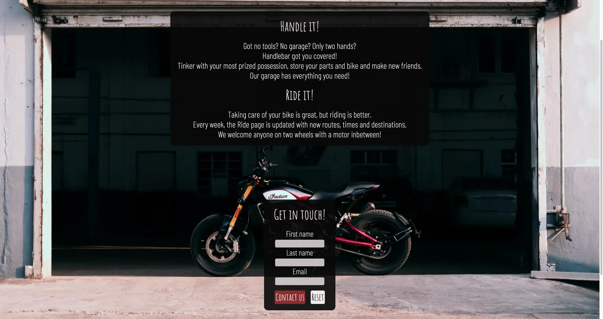
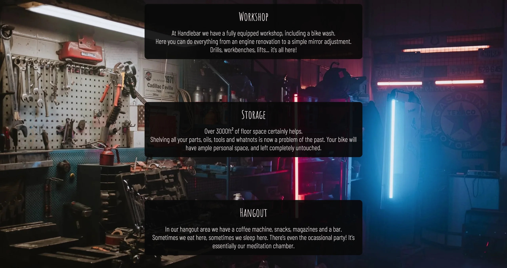
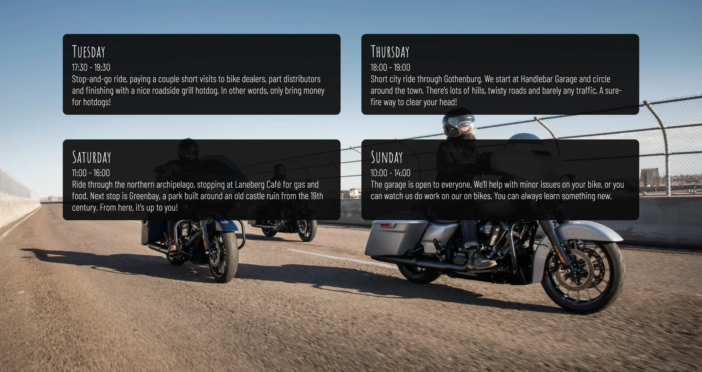
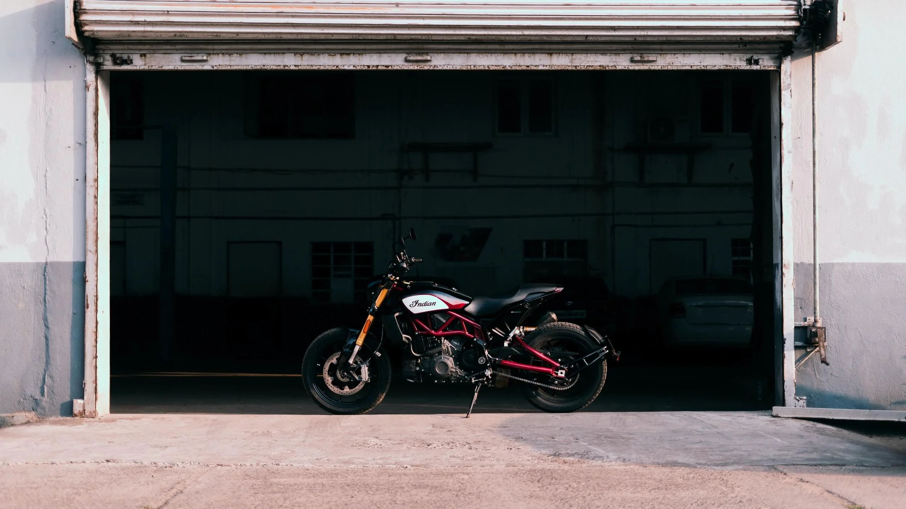
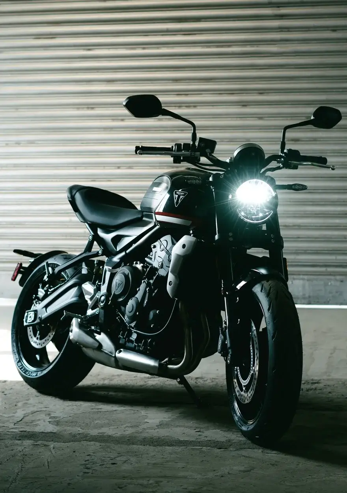
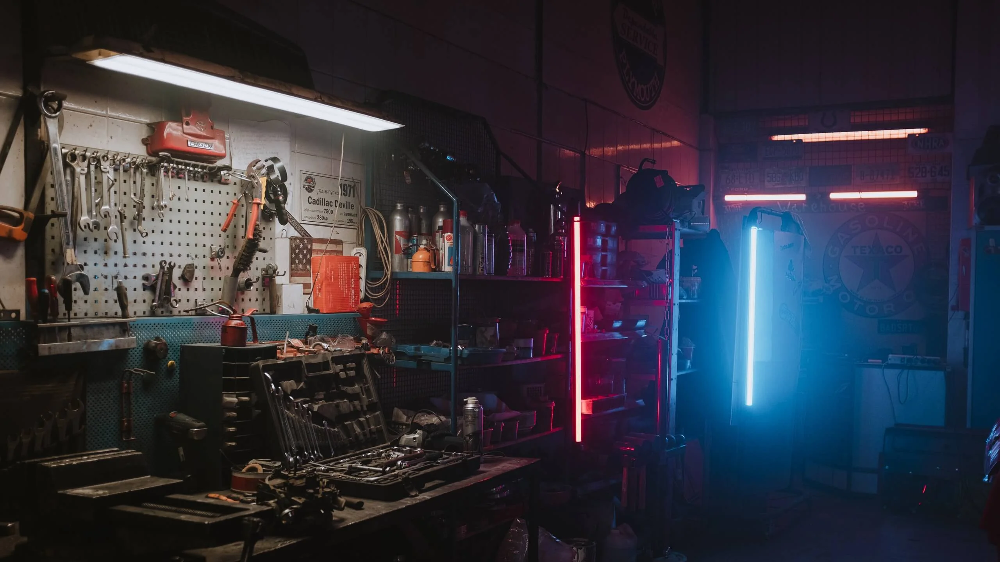
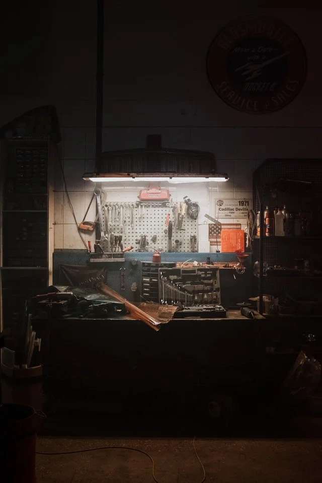
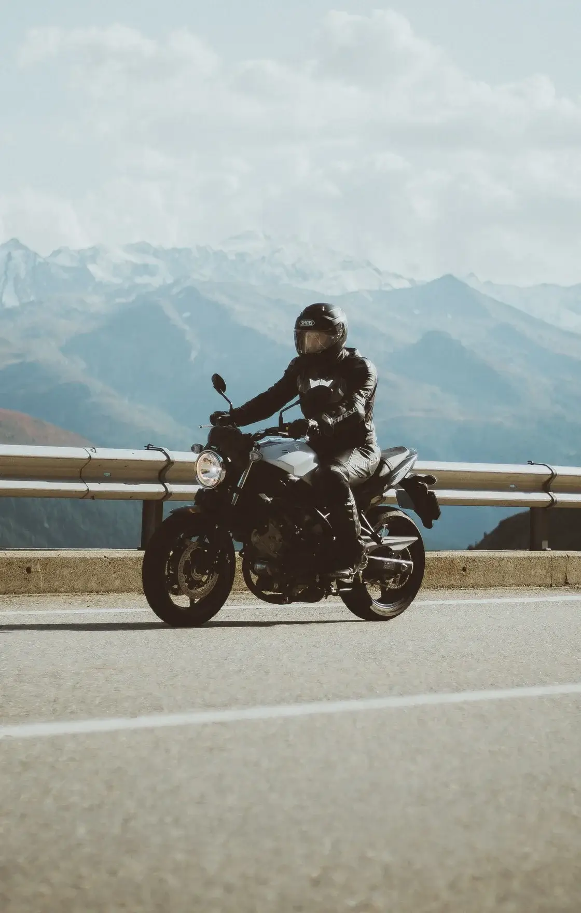
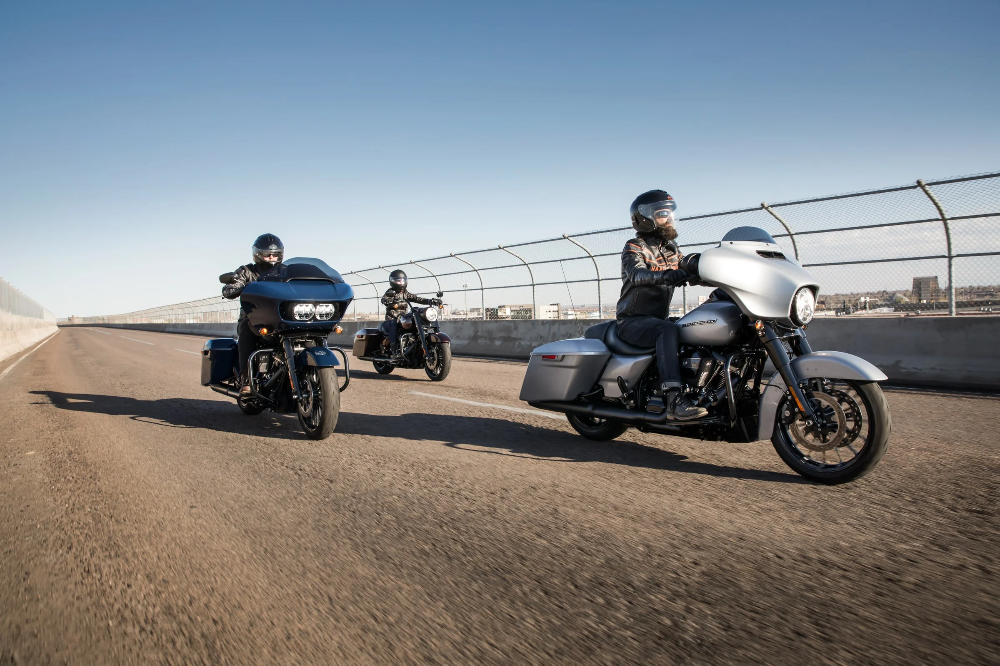

<h1 align="center" style="font-size: 250%;"><b>
Handlebar Garage Website
</b></h1>

[Check the live project here!](https://jfrdrkssn.github.io/first-project-ci/index.html)

This is the website for Handlebar Garage. It is designed to be responsive and accessible on multiple devices.
The purpose of the site is to provide users a 

---
## **User Experience (UX)**  
---  

- ### **User stories**  

    - **First Time Visitor Goals**

        - As a First Time Visitor, I want to easily recognize the subject of the site.
        - As a First Time Visitor, I want to intuitively understand how to navigate throughout the site to find more information.
        - As a First Time Visitor, I want to locate the organization's social media links to familiarize with the organization.

    - **Returning Visitor Goals**

        - As a Returning Visitor, I want to find information about rides and other events.
        - As a Returning Visitor, I want to find ways to contact the organization.

    - **Frequent User Goals**
    
        - As a Frequent User, I want to check for new group rides and events.
        - As a Frequent User, I want to check if there is any updates to the website and/or organization.

- ### **Design**

    - **Colour Scheme**

        - The two main colors used throughout the site are dark grey and white. They make the website easy to read and provide a clean look.
        - CTA button is colored red for extra visibility.
        - Additional color is added through the background images, chosen to fit with the pages subject.
    
    - **Typography**

        - The Amatic SC font is used for the logo, headings, navbar and buttons. It's rougher appearence fits well with the general subject of the website. Sans-serif is used as a backup-font.
        - The Barlow Condensed font is used for text content and contact information. It has a clean look to complement and contrast the Amatic SC font.
        -  Sans-serif is used as a backup-font.
    
    - **Imagery**

        - Background images have been specifically chosen for their respective part of the website. The images represent the content they were chosen for in a cohesive manner.

---
## **Features**
---
- **Responsive on all device sizes**

    - [Am I Responsive?](http://ami.responsivedesign.is/?url=https://jfrdrkssn.github.io/first-project-ci/index.html)

---

- **Navigation**

    - At the top of every page on the website, the navigation shows the name of the organization to the left, Handlebar, and it links to the Home page. Navigation links to the other pages on the website can be found to the right, named according to the content on the page.
    - The navigation links to the right provide feedback when they are the active page and also when hovered on.

---

- **Home page**

    - The Home page main content contains basic information about what the organization can offer and what it does.
    - The home page has a form with a CTA button to provide users with a way to get in touch with the organization.
    - The form is easy to understand and provides feedback on input fields and buttons alike.
    - The background

---

- **Garage page**

    - The Garage page contains detailed information about the organization's physical garage, storage possibilites and social area.
    -

---

- **Ride page**

    - The Ride page provides information about rides and events that is updated every week.

---

- **Footer**

    - The footer contains all the information needed to contact the organization. 
    - All content in the footer are clickable links and provide feedback when hovered. They give the user a quick and easy way to contact the information.

---
## **Technologies**
---

### **Languages**

-   [HTML5](https://en.wikipedia.org/wiki/HTML5)
-   [CSS3](https://en.wikipedia.org/wiki/CSS)

### **Programs**
1.  [Gitpod](https://gitpod.io)
    - Gitpod was used to write all code
2.  [Git](https://git-scm.com/)
    - Git was used for version control by utilizing the Gitpod terminal to commit Git and Push to GitHub.
3.  [GitHub](https://github.com/)
    - GitHub is used to store the projects code after being pushed from Git.
4.  [Google Fonts](https://fonts.google.com/)
    - Google fonts were used import the Amatic SC and Barlow Condensed fonts.
5.  [Font Awesome](https://fontawesome.com/)
    - Font Awesome was used to style social media links.
6.  [Online-Convert](https://www.online-convert.com/)
    - Online convert was used to convert and resize images.
7.  [TinyPNG](https://tinypng.com/)
    - TinyPNG was used to compress image files.
8.  [Balsamiq](https://balsamiq.com/)
    - Balsamiq was used to create wireframes for design purposes.

---
## **Testing**
---

The W3C Markup Validator and W3C CSS Validator Services were used to validate every page of the project to ensure there were no syntax errors in the project.

- [W3C Markup Validator]() - [Results](https://validator.w3.org/nu/?doc=https%3A%2F%2Fjfrdrkssn.github.io%2Ffirst-project-ci%2Fride.html)
- [W3C CSS Validator]() - [Results](http://jigsaw.w3.org/css-validator/validator?uri=https%3A%2F%2Fjfrdrkssn.github.io%2Ffirst-project-ci%2Fride.html&profile=css3svg&usermedium=all&warning=1&vextwarning=)

---
## **Credits**
---

### **Media**

### **[Sourav Mishra, Pexels](https://www.pexels.com/@photosbymishra)**

### **[cottonbro, Pexels](https://www.pexels.com/@cottonbro)**

### **[Chris Henry, Unsplash](https://unsplash.com/@chrishenryphoto)**

### **[Harley-Davidson, Unsplash](https://unsplash.com/@harleydavidson)**

