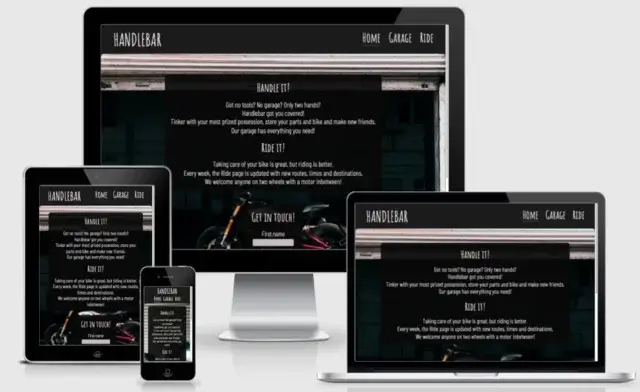
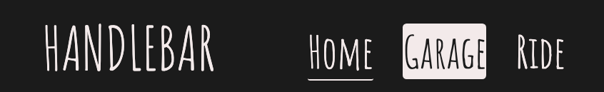

<h1 align="center" style="font-size: 250%;"><b>
Handlebar Garage Website
</b></h1>

[Check the live project here!](https://jfrdrkssn.github.io/first-project-ci/index.html)

This is the website for Handlebar Garage. It is designed to be responsive and accessible on multiple devices.

---
## **User Experience (UX)**  
---  

- ### **User stories**  

    - **First Time Visitor Goals**

        - As a First Time Visitor, I want to easily recognize the subject of the site.
        - As a First Time Visitor, I want to intuitively understand how to navigate throughout the site to find more information.
        - As a First Time Visitor, I want to locate the organization's social media links to familiarize with the organization.

    - **Returning Visitor Goals**

        - As a Returning Visitor, I want to find information about rides and other events.
        - As a Returning Visitor, I want to find ways to contact the organization.

    - **Frequent User Goals**
    
        - As a Frequent User, I want to check for new group rides and events.

- ### **Design**

    - **Colour Scheme**

        - The two main colors used throughout the site are dark grey and white. They make the website easy to read and provide a clean look.
        - CTA button is colored red for extra visibility.
        - Additional color is added through the background images, chosen to fit with the pages subject.
    
    - **Typography**

        - The Amatic SC font is used for the logo, headings, navbar and buttons. It's rougher appearence fits well with the general subject of the website.
        - The Barlow Condensed font is used for text content and contact information. It has a clean look to complement and contrast the Amatic SC font.
        -  Sans-serif is used as a backup-font.
    
    - **Imagery**

        - Background images have been specifically chosen for their respective part of the website. The images represent the content they were chosen for in a cohesive manner.

- ### **Wireframes**

---
## **Features**
---
- **Responsive on all device sizes**

    - [Am I Responsive?](http://ami.responsivedesign.is/?url=https://jfrdrkssn.github.io/first-project-ci/index.html)

---

- **Navigation**

    - At the top of every page on the website, the navigation shows the name of the organization to the left, Handlebar, and it links to the Home page. Navigation links to the other pages on the website can be found to the right, named according to the content on the page.
    - The navigation links to the right provide feedback when they are the active page and also when hovered on.

---

- **Home page**

    - The Home page main content contains basic information about what the organization can offer and what it does.
    - The home page has a form with a CTA button to provide users with a way to get in touch with the organization.
    - The form is easy to understand and provides feedback on input fields and buttons alike.

---

- **Garage page**

    - The Garage page contains detailed information about the organization's physical garage, storage possibilites and social area.
    -

---

- **Ride page**

    - The Ride page provides information about rides and events that is updated every week.

---

- **Footer**

    - The footer contains all the information needed to contact the organization. 
    - All content in the footer are clickable links and provide feedback when hovered. They give the user a quick and easy way to contact the organization.

- **Unfinished features**

- On the Rides page, a weather widget and Google Maps window was planned. Clicking on a specific ride would update the map to include the route. This would enable the user to both see the route on the page and link the route to the users own GPS. The layout is visible on the wireframes.

---
## **Technologies**
---

### **Languages**

-   [HTML5](https://en.wikipedia.org/wiki/HTML5)
-   [CSS3](https://en.wikipedia.org/wiki/CSS)

### **Programs**
1.  [Gitpod](https://gitpod.io)
    - Gitpod was used to write all code
2.  [Git](https://git-scm.com/)
    - Git was used for version control by utilizing the Gitpod terminal to commit Git and Push to GitHub.
3.  [GitHub](https://github.com/)
    - GitHub is used to store the projects code after being pushed from Git.
4.  [Google Fonts](https://fonts.google.com/)
    - Google fonts were used import the Amatic SC and Barlow Condensed fonts.
5.  [Font Awesome](https://fontawesome.com/)
    - Font Awesome was used to style social media links.
6.  [Online-Convert](https://www.online-convert.com/)
    - Online convert was used to convert and resize images.
7.  [TinyPNG](https://tinypng.com/)
    - TinyPNG was used to compress image files.
8.  [Balsamiq](https://balsamiq.com/)
    - Balsamiq was used to create wireframes for design purposes.
9.  [Contrast Checker](https://webaim.org/resources/contrastchecker/)
    - Contrast Check was used to confirm that colors had adequate contrast.

---
## **Testing**
---

The W3C Markup Validator and W3C CSS Validator Services were used to validate every page of the project to ensure there were no syntax errors in the project.

- [W3C Markup Validator]() - [Results](https://validator.w3.org/nu/?doc=https%3A%2F%2Fjfrdrkssn.github.io%2Ffirst-project-ci%2Fride.html)
- [W3C CSS Validator]() - [Results](http://jigsaw.w3.org/css-validator/validator?uri=https%3A%2F%2Fjfrdrkssn.github.io%2Ffirst-project-ci%2Fride.html&profile=css3svg&usermedium=all&warning=1&vextwarning=)

### **Testing User Stories from User Experience (UX) Section**

- **First Time Visitor Goals**

    - As a First Time Visitor, I want to easily recognize the subject of the site.
        - The background image, logo and text content clearly represents the main site subject is.
    - As a First Time Visitor, I want to intuitively understand how to navigate throughout the site to find more information.
        - The navigation at the top of the site provide clear names for different pages and visual feedback to let the user know where they are.
    - As a First Time Visitor, I want to locate the organization's social media links to familiarize with the organization.
        - The home page main content follows a clear vertical direction where the user will end up at the bottom where clear icons for social media networks are shown.

- **Returning Visitor Goals**

    - As a Returning Visitor, I want to find information about rides and other events.
        - The Rides page link in the navigation bar describe where the user will end up clearly.
    - As a Returning Visitor, I want to find ways to contact the organization.
        - The Home page has a clear and visible contact form and the bottom of each page contains all other contact information.

- **Frequent User Goals**
    
    - As a Frequent User, I want to check for new group rides and events.
        - The Ride page is updated weekly. This is clearly stated on the Home page.

## **Further Testing**

- The website was tested on Google Chrome and Safari browsers.
- The website was viewed on Desktop, iPhone 6 and Galaxy S9.
- Friends and family viewed and tested the site to provide feedback.
- [Google Mobile-Friendly Test](https://search.google.com/test/mobile-friendly/result?id=d08keSzbsW3DO75zwF8d-A) was used to test mobile version.
- Lighthouse was used to test both mobile and desktop versions.

## **Bugs**

- Navbar didn't stick to the right when changing screen width.
    - Fix: Replace absolute size values with percentage values for background images.
- Header logo and navbar stacked on the left side and on top of each other between 764px and 784px.
    - Fix: Remove padding for navbar a elements and reduce padding by 2px for navbar li elements.
- Font size on Safari did not change with browser width.
    - Fix: Remove forced zoom from Safari browser.
        - Initially, percentage values for font-sizes was replaced with em values. This did nothing.
- Background images was not loading in Safari.
    -Fix: Change the file extensions form webp to jpg.

---
## **Credits**
---

### **Code**

- The social media links code for the project was sourced from [this repository](https://github.com/JFrdrkssn/love-running-jf), a coding walkthrough project in [Code Institute's](https://codeinstitute.net/) course curriculum.

### **Content**

- The structure and layout of this README.md was based on [this template](https://github.com/Code-Institute-Solutions/SampleREADME) by [Code Institute](https://codeinstitute.net/). Some text was also copied. Additional inspiration for this README.md was given from other templates in Code Institute's course curriculum.

### **Media**

### **[Sourav Mishra, Pexels](https://www.pexels.com/@photosbymishra)**

[Photo by Sourav Mishra, used on Home page](https://www.pexels.com/photo/city-people-street-graffiti-4515543/)

[Photo by Sourav Mishra, used on Home page for mobile and tablet](https://www.pexels.com/photo/road-street-vehicle-vintage-7511825/)

### **[cottonbro, Pexels](https://www.pexels.com/@cottonbro)**

[Photo by cottonbro, used on Garage page](https://www.pexels.com/photo/black-and-gray-audio-mixer-4488660/)

[Photo by cottonbro, used on Garage page for mobile and tablet](https://www.pexels.com/photo/white-and-red-plastic-container-on-black-table-4488651/)

### **[Chris Henry, Unsplash](https://unsplash.com/@chrishenryphoto)**

[Photo by Chris Henry, used on Ride page for mobile and tablet](https://unsplash.com/photos/pO6Zu1tRUlA)

### **[Harley-Davidson, Unsplash](https://unsplash.com/@harleydavidson)**

[Photo by Harley-Davidson, used on Ride page](https://unsplash.com/photos/LUWVMSyNsR4)

### **Acknowledgements**

- My Mentor, Gerard McBride, for continuous helpful feedback and support.